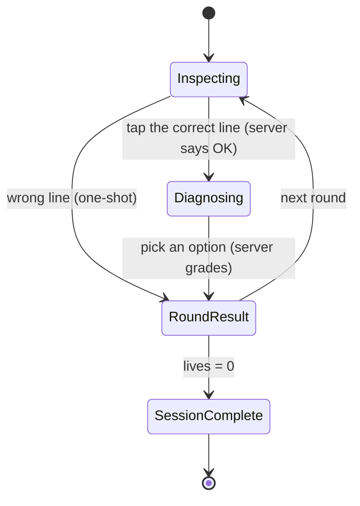
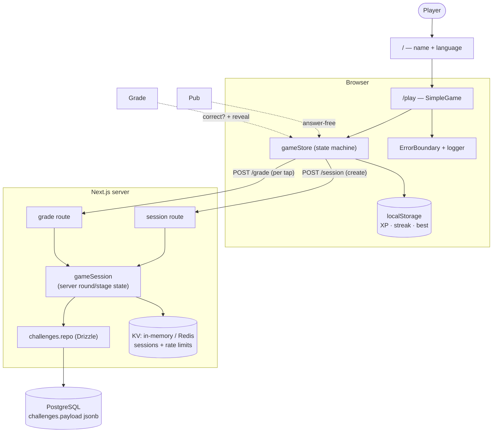
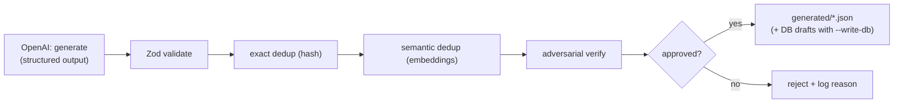

# Bug Hunter 🐛

A fast, mobile-first debugging game. Enter a name, pick a language, then **tap the
buggy line** and **choose what's wrong** before the timer runs out — every wrong
call is a real production incident.

Next.js + TypeScript on the front, **PostgreSQL** on the back. Challenges live in
the database (never in git); the server sends the browser an **answer-stripped**
view and **grades on the server**, so questions and answers are never shipped to
the client. New challenges are grown by an OpenAI **generate → validate → dedup →
verify** pipeline.

---

## Quick start

```bash
cp .env.example .env          # set DATABASE_URL (+ OPENAI_API_KEY for the pipeline)
make setup                    # install + start Postgres + migrate + seed
make dev                      # http://localhost:3000  (best on a phone / narrow)
```

Prefer raw commands? The equivalent without `make`:

```bash
npm install
docker compose up -d db       # start Postgres (or use your own)
npm run db:migrate            # create the schema
npm run db:seed               # load seed/challenges.json into the DB (git-ignored)
npm run dev
```

Run `make help` to list all shortcuts (`make check` runs the full CI gauntlet
locally; `make db-reset` rebuilds the database).

> **Where do the questions come from?** They are **not in the repo.** A baseline
> lives in a git-ignored `seed/challenges.json`; `db:seed` loads it, and the
> generation pipeline can write more straight to the DB. Keep a backup of your
> seed/DB — a fresh `git clone` has no questions by design.

Every task has a `make` shortcut (each wraps an `npm` script — run `make help`):

| Command                                       | What it does                                                        |
| --------------------------------------------- | ------------------------------------------------------------------- |
| `make setup`                                  | First-time: install + start Postgres + migrate + seed               |
| `make dev` / `build` / `start`                | Next.js dev / production build / serve                              |
| `make db-up` / `db-down` / `migrate` / `seed` | Start-and-wait / stop / migrate / seed Postgres                     |
| `make db-reset`                               | Drop and rebuild the database from scratch                          |
| `make check`                                  | Full CI gauntlet locally (lint · format · typecheck · test · build) |
| `make gen LANG=python N=8 DB=1`               | Generate + verify challenges (`DB=1` also upserts to Postgres)      |
| `make lint` / `format` / `typecheck` / `test` | Individual quality gates                                            |

Underlying npm scripts (`npm run …`): `dev`, `build`, `start`, `db:migrate`,
`db:seed`, `db:push`, `db:generate`, `lint`, `format`, `typecheck`, `test`,
`gen:challenges -- <lang> [n] [--write-db]` (needs `OPENAI_API_KEY`).

---

## How the game works

Enter name + language → tap the buggy line → pick the diagnosis (3–4 options) →
see the explanation and production impact → next round. 60s/round, 3 lives, one
guess per step, endless until your lives run out. High score is saved locally.



---

## Architecture

Answers live only in Postgres and are compared only on the server. The browser
receives `PublicChallenge` (code + options, **no** correct-answer keys) and posts
each guess to a grade endpoint.



### Layout

```text
src/
  app/
    api/challenges/session   POST → create session, answer-stripped queue
    api/challenges/grade     POST → server-graded within the session
    / (start) · /play · /profile · error/global-error/not-found
  components/game/           SimpleGame, Confetti
  components/common/         ErrorBoundary, PageHeader
  db/                        schema.ts (Drizzle), index.ts (client), challenges.repo.ts
  stores/                    gameStore (async, server-graded), userStore, settingsStore
  services/                  challengeService (pure), gameSession (server anti-cheat), gameApi (client)
  hooks/                     useTimer, useSound, useHydrated
  lib/                       scoring, ranks, constants, logger, syntax, cn, kv (memory/redis), rate-limit
  schemas/                   Zod challenge schema
  types/                     shared TypeScript types (challenge, game)
  test/                      synthetic fixtures + local grader (unit tests, no DB)
scripts/
  generate-challenges.ts     OpenAI generate → validate → dedup(DB) → verify → gate
  db-migrate.ts · db-seed.ts · scan-secrets.mjs
drizzle/                     generated SQL migrations
Makefile                     make shortcuts (wrap the npm scripts)
docker-compose.yml           Postgres service

Tests live next to their source as *.test.ts.
```

---

## Database

- **Drizzle ORM** over `pg`. One `challenges` table: scalar columns for filtering
  (`language`, `status`, …) plus a `payload jsonb` holding the full challenge
  **with answers** (server-only).
- `docker compose up -d db` starts Postgres; `db:migrate` applies `drizzle/*.sql`;
  `db:seed` loads the git-ignored `seed/challenges.json`.
- The **client never imports the bank** — it fetches `PublicChallenge` from the
  API. Grading (`isBugLineCorrect`, …) runs only in the grade route.

---

## Deploy ($0 — Cloud Run)

A minimal, near-free setup: Cloud Run (scales to zero) + a **free** managed
Postgres (Neon or Supabase). No Redis, no VPC — a single instance uses the
in-memory rate limiter + sessions.

```bash
# 1. Create a free Postgres (neon.tech or supabase.com) → copy its connection string.
export DATABASE_URL="postgres://…"        # your PROD database

# 2. Create the schema + seed it (once, from your machine, against prod):
npm run db:migrate && npm run db:seed

# 3. Deploy (needs `gcloud auth login` + a project set):
make deploy                                # → prints an https:// URL
```

`make deploy` runs `gcloud run deploy --source .` with `--min-instances=0
--max-instances=1` (scales to zero, one instance when busy → in-memory state
works), `--memory=512Mi`, public access, and injects `DATABASE_URL`. HTTPS is
automatic. Override the service name/region with `SERVICE=… REGION=… make deploy`.

**Free-tier must-dos (all free):** turn on **automated backups** on your Postgres
(the challenge bank lives only there), use a **strong DB password over TLS**, and
set a **GCP budget alert**. Optional upgrades later: Secret Manager instead of an
env var (`--set-secrets`), and Upstash Redis (`REDIS_URL`) if you raise
`--max-instances` above 1.

### Continuous deployment

`.github/workflows/deploy.yml` redeploys to Cloud Run on every merge to `main`.
It authenticates **keyless** via Workload Identity Federation (no service-account
key stored in GitHub — a short-lived OIDC token scoped to this repo), and it does
**not** pass `--set-env-vars`, so the `DATABASE_URL` already set on the service is
preserved and never travels through CI. Flow: PR → `develop` → `main` (both
CI-gated) → auto-deploy.

---

## Content pipeline



```bash
npm run gen:challenges -- javascript 8              # writes generated/*.json for review
npm run gen:challenges -- javascript 8 --write-db   # also upserts approved as DRAFTS
```

Dedup (hash + embeddings) runs against the **live DB bank**, so `DATABASE_URL`
must point at the bank you actually publish from — otherwise dedup silently
degrades to batch-only.

**Generated challenges are never published automatically.** `--write-db` writes
`status='draft'`, which `getPool` excludes, so drafts are invisible to players
until a human promotes them.

This is deliberate. The adversarial verify pass is useful but fallible — it has
approved challenges whose "correct" fix provably breaks the code. A human reads
the draft before players do.

### Adding challenges to production

Needs `OPENAI_API_KEY` in `.env` (generation calls OpenAI and costs money) and
`gcloud` logged in. The prod DB has no public address, so everything below goes
through an SSH tunnel.

```bash
make tunnel                       # terminal 1 — leave running (silent = working)

make gen-prod LANG=python N=8     # terminal 2 — generate; lands as DRAFTS
make gen-prod LANG=javascript N=8
make review                       # step through each draft: [p]ublish [d]elete [s]kip
make backup                       # dump prod to ~/bughunter-backup-<date>.sql
```

Only `gen-prod` spends money. `review` just reads what is already in the DB.
Expect roughly 1–3 of 8 candidates to survive the verify pass.

`make review` prints each draft with the bug line marked `▸` and the answer key
beside it, then waits for one keypress. `p` publishes it — live immediately, no
deploy. Read it first: check the `▸` line is really the bug, the `✓` fix really
works, and every `✗` option is actually wrong.

Count what is in the bank, before and after:

```bash
gcloud compute ssh bug-hunter-db --zone=us-central1-a --tunnel-through-iap \
  --command="docker exec -i pg psql -U bughunter -d bughunter -c \"SELECT language, status, COUNT(*) FROM challenges GROUP BY language, status ORDER BY language, status;\""
```

Or ask the live site what players actually get:

```bash
curl -s -X POST https://bug-hunter-891741363607.us-central1.run.app/api/challenges/session \
  -H "Content-Type: application/json" -d '{"lang":"python","count":50}' | grep -o '"id"' | wc -l
```

Other targets: `make drafts` (list), `make show ID=…` (read one),
`make publish ID=…` / `make unpublish ID=…` (promote or pull back).

Answers (`bugLineIds`, `isCorrect`, `explanation`) live only in the database and
in git-ignored files. `/generated` and `/seed` are in `.gitignore` and must stay
there: this repo is public, and committing either would publish the answer key.
That is why there is no PR-based review flow for generated content.

---

## Production practices

- **Answer safety** — questions/answers are in Postgres only; the client gets a
  stripped projection and every guess is graded server-side.
- **Abuse protection** — (a) **server-authoritative sessions**: the server owns
  round/stage state, so a client gets exactly one answer per stage — a wrong guess
  ends the round and can't be retried, which closes answer enumeration; (b) per-IP
  **rate limiting** (`session` 30/min, `grade` 300/min → `429`). Both use a shared
  store (Redis via `REDIS_URL`) or fall back to in-memory for a single instance.
- **Security headers** — `next.config.mjs` sets CSP, HSTS, `X-Frame-Options: DENY`,
  `nosniff`, `Referrer-Policy`, `Permissions-Policy`, and drops `X-Powered-By`.
- **SQL safety** — Drizzle parameterized queries only (no raw SQL); API inputs are
  Zod-validated.
- **Dependency audit** — CI fails on high/critical advisories in production deps
  (`npm audit --omit=dev --audit-level=high`).
- **Logging + redaction** — `src/lib/logger.ts` scrubs API keys and secret-like
  env values from all output; API routes return generic errors (no stack traces).
- **Exception handling** — retry/backoff on external calls, global handlers in
  scripts, Next error/global-error/not-found boundaries + a game `ErrorBoundary`,
  and grade failures never cost the player a life.
- **Tests** — Vitest units (scoring, ranks, schema, service, state machine) using
  synthetic fixtures + a local grader, plus a DB integration test (CI runs
  Postgres; local `npm test` skips it without `DATABASE_URL`).
- **Pre-commit hooks** (husky) — lint-staged + secret scan; pre-push typecheck +
  tests.
- **CI** (`.github/workflows/ci.yml`) — on PR/push to `main`+`develop`: secret scan
  → dep audit → lint → format → typecheck → migrate → tests → build (with Postgres
  - Redis services).

---

## Not in this phase

Real accounts/auth and a networked leaderboard (progress is still local
`localStorage`). Remaining hardening follow-ups: **nonce-based CSP** (the current
CSP allows `'unsafe-inline'` for the app's inline styles/scripts) and production
**error monitoring** (e.g. Sentry).
