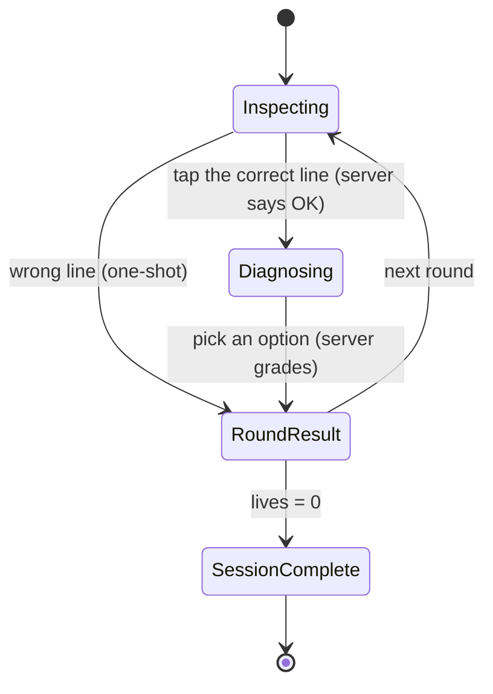
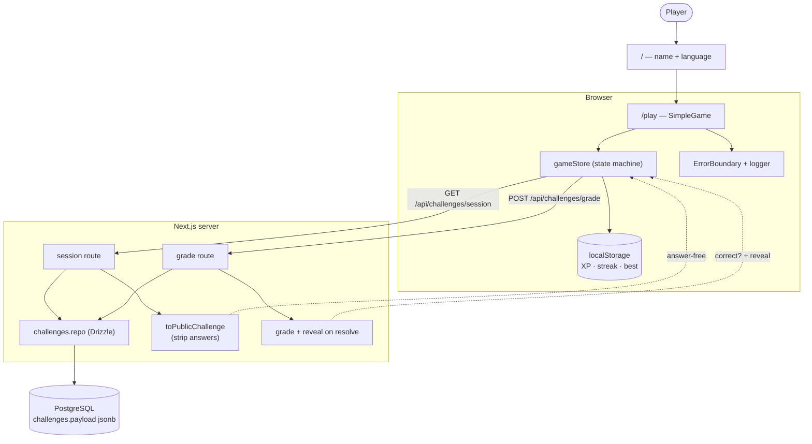
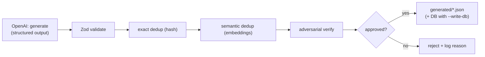

# Bug Hunter 🐛

A fast, mobile-first debugging game. Enter a name, pick a language, then **tap the
buggy line** and **choose what's wrong** before the timer runs out — every wrong
call is a real production incident.

Next.js + TypeScript on the front, **PostgreSQL** on the back. Challenges live in
the database (never in git); the server sends the browser an **answer-stripped**
view and **grades on the server**, so questions and answers are never shipped to
the client. New challenges are grown by an OpenAI **generate → validate → dedup →
verify** pipeline.

---

## Quick start

```bash
cp .env.example .env          # set DATABASE_URL (+ OPENAI_API_KEY for the pipeline)
make setup                    # install + start Postgres + migrate + seed
make dev                      # http://localhost:3000  (best on a phone / narrow)
```

Prefer raw commands? The equivalent without `make`:

```bash
npm install
docker compose up -d db       # start Postgres (or use your own)
npm run db:migrate            # create the schema
npm run db:seed               # load seed/challenges.json into the DB (git-ignored)
npm run dev
```

Run `make help` to list all shortcuts (`make check` runs the full CI gauntlet
locally; `make db-reset` rebuilds the database).

> **Where do the questions come from?** They are **not in the repo.** A baseline
> lives in a git-ignored `seed/challenges.json`; `db:seed` loads it, and the
> generation pipeline can write more straight to the DB. Keep a backup of your
> seed/DB — a fresh `git clone` has no questions by design.

| Script                                              | What it does                                          |
| --------------------------------------------------- | ----------------------------------------------------- |
| `npm run dev` / `build` / `start`                   | Next.js dev / production build / serve                |
| `npm run db:migrate` / `db:seed` / `db:push`        | Apply migrations / load seed / dev-sync schema        |
| `npm run db:generate`                               | Generate a new migration from the Drizzle schema      |
| `npm run lint` · `format` · `typecheck` · `test`    | Quality gates                                         |
| `npm run gen:challenges -- <lang> [n] [--write-db]` | Generate + verify challenges (needs `OPENAI_API_KEY`) |

---

## How the game works

Enter name + language → tap the buggy line → pick the diagnosis (3–4 options) →
see the explanation and production impact → next round. 60s/round, 3 lives, one
guess per step, endless until your lives run out. High score is saved locally.



---

## Architecture

Answers live only in Postgres and are compared only on the server. The browser
receives `PublicChallenge` (code + options, **no** correct-answer keys) and posts
each guess to a grade endpoint.



### Layout

```text
src/
  app/
    api/challenges/session   GET  → answer-stripped queue
    api/challenges/grade     POST → server-side grading + reveal
    / (start) · /play · /profile · error/global-error/not-found
  components/game/           SimpleGame, Confetti
  components/common/         ErrorBoundary, PageHeader
  db/                        schema.ts (Drizzle), index.ts (client), challenges.repo.ts
  stores/                    gameStore (async, server-graded), userStore, settingsStore
  services/                  challengeService (pure: project/grade/select), gameApi (client fetch)
  lib/                       scoring, ranks, constants, logger (redaction), syntax, cn
  schemas/                   Zod challenge schema
  test/                      synthetic fixtures + local grader (unit tests, no DB)
scripts/
  generate-challenges.ts     OpenAI generate → validate → dedup(DB) → verify → gate
  db-migrate.ts · db-seed.ts · scan-secrets.mjs
drizzle/                     generated SQL migrations
docker-compose.yml           Postgres service
```

---

## Database

- **Drizzle ORM** over `pg`. One `challenges` table: scalar columns for filtering
  (`language`, `status`, …) plus a `payload jsonb` holding the full challenge
  **with answers** (server-only).
- `docker compose up -d db` starts Postgres; `db:migrate` applies `drizzle/*.sql`;
  `db:seed` loads the git-ignored `seed/challenges.json`.
- The **client never imports the bank** — it fetches `PublicChallenge` from the
  API. Grading (`isBugLineCorrect`, …) runs only in the grade route.

---

## Content pipeline



```bash
npm run gen:challenges -- javascript 8              # writes generated/*.json for review
npm run gen:challenges -- javascript 8 --write-db   # also upserts approved into Postgres
```

Dedup (hash + embeddings) runs against the **live DB bank**. The nightly Action
(`.github/workflows/generate-challenges.yml`) generates for both languages and
opens a PR; set a hosted `DATABASE_URL` secret to enable DB dedup/writes.

---

## Production practices

- **Answer safety** — questions/answers are in Postgres only; the client gets a
  stripped projection and every guess is graded server-side.
- **Logging + redaction** — `src/lib/logger.ts` scrubs API keys and secret-like
  env values from all output.
- **Exception handling** — retry/backoff on external calls, global handlers in
  scripts, Next error/global-error/not-found boundaries + a game `ErrorBoundary`,
  and grade failures never cost the player a life.
- **Tests** — Vitest units (scoring, ranks, schema, service, state machine) using
  synthetic fixtures + a local grader, plus a DB integration test (CI runs
  Postgres; local `npm test` skips it without `DATABASE_URL`).
- **Pre-commit hooks** (husky) — lint-staged + secret scan; pre-push typecheck +
  tests.
- **CI** (`.github/workflows/ci.yml`) — on PR/push to `main`+`develop`: secret scan
  → lint → format → typecheck → migrate → tests → build (with a Postgres service).

---

## Not in this phase

Real accounts/auth and a networked leaderboard (progress is still local
`localStorage`). Per-round anti-cheat (server session state) is a follow-up — today
the grade endpoint is stateless, so answers are protected from the repo and the
bundle but a scripted client could still enumerate a single challenge's options.
