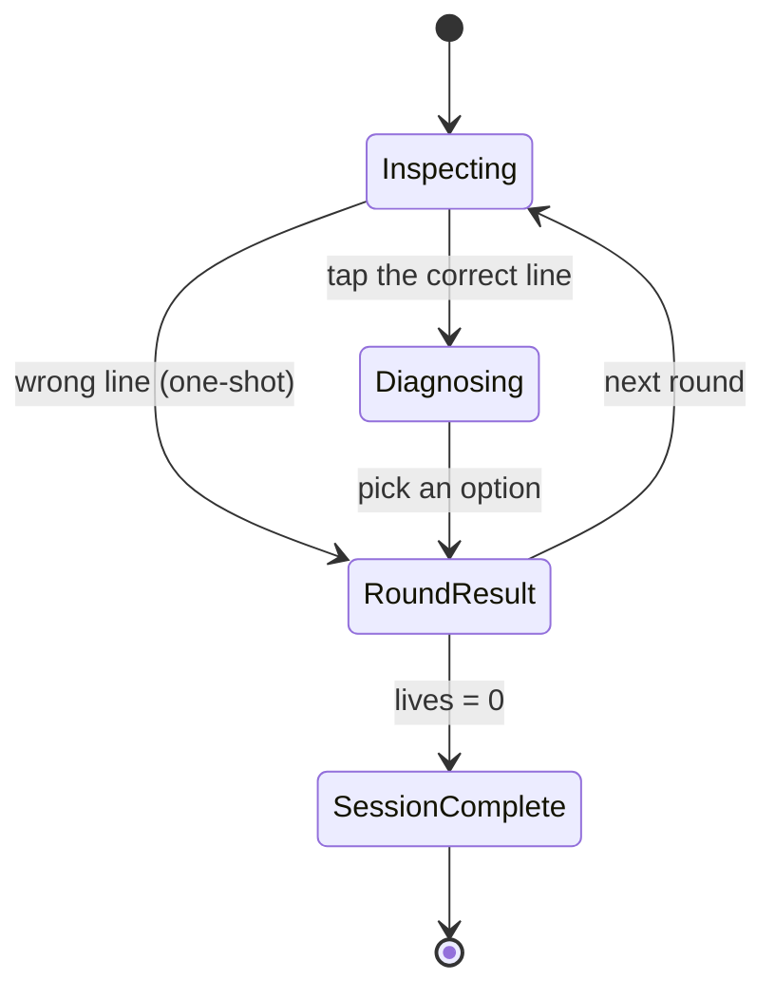
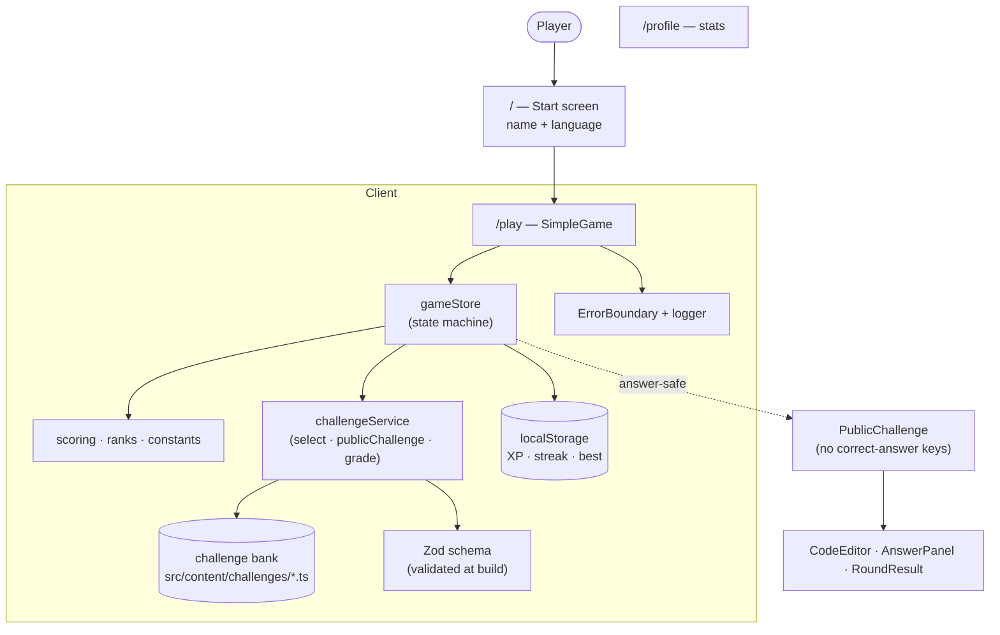
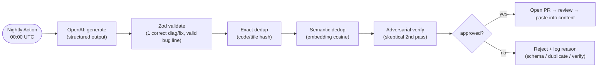

# Bug Hunter 🐛

A fast, mobile-first debugging game. Enter a name, pick a language, then **tap the
buggy line** and **choose what's wrong** before the timer runs out — every wrong
call is a real production incident.

Built with Next.js + TypeScript. Game logic, scoring, and content are real;
player progress persists in the browser. New challenges are grown by a nightly
**OpenAI generate → validate → dedup → verify** pipeline that opens a PR for review.

---

## Quick start

```bash
npm install
npm run dev        # http://localhost:3000  (best viewed narrow / on a phone)
```

| Script                                 | What it does                                              |
| -------------------------------------- | --------------------------------------------------------- |
| `npm run dev` / `build` / `start`      | Next.js dev / production build / serve                    |
| `npm run lint` / `lint:fix`            | ESLint (next + prettier)                                  |
| `npm run format` / `format:check`      | Prettier write / check                                    |
| `npm run typecheck`                    | `tsc --noEmit`                                            |
| `npm run test` / `test:run`            | Vitest (watch / once)                                     |
| `npm run scan:secrets`                 | Fail if a credential is committed                         |
| `npm run gen:challenges -- <lang> [n]` | Generate + verify new challenges (needs `OPENAI_API_KEY`) |

---

## How the game works

Enter name + language → tap the buggy line → pick the diagnosis (3–4 options) →
see the explanation and production impact → next round. 60s per round, 3 lives,
one guess per step, endless until your lives run out. High score is saved locally.



The store also supports a fuller Inspect → Find → **Diagnose** → **Fix** → Result
loop (used by the richer `GameShell`), gated behind the same state machine.

---

## Architecture



**Answer safety:** the UI only ever receives the answer-stripped `PublicChallenge`
projection (options shuffled deterministically, no `isCorrect` / bug line /
explanation). Grading runs against the full challenge behind `challengeService`,
so a real backend can slot in there without UI changes.

### Layout

```text
src/
  app/            routes: / (start), /play, /profile, error/global-error/not-found
  components/
    game/         SimpleGame, GameShell, CodeEditor, AnswerPanel, RoundResult, …
    common/       ErrorBoundary, PageHeader
  stores/         gameStore (state machine), userStore, settingsStore (Zustand + persist)
  lib/            scoring, ranks, constants, logger (redaction), syntax highlighter, cn
  services/       challengeService (select, daily seed, public projection, grading)
  schemas/        Zod challenge schema + validator
  content/        challenge data (javascript.ts, python.ts) via a compact builder
  hooks/          useTimer, useSound, useHydrated
scripts/
  generate-challenges.ts   OpenAI generate → validate → dedup → verify → gate
  scan-secrets.mjs         credential scanner (pre-commit + CI)
```

---

## Content pipeline (nightly)

Challenges are grown by an OpenAI pipeline that never auto-publishes — it opens a
PR you review.



Run it locally:

```bash
cp .env.example .env      # paste your OPENAI_API_KEY
npm run gen:challenges -- javascript 8
npm run gen:challenges -- python 8
```

Approved candidates are written to `generated/*.json` for review. Env knobs:
`OPENAI_MODEL`, `OPENAI_VERIFY_MODEL`, `OPENAI_EMBED_MODEL`, `DEDUP_SIM_THRESHOLD`.

**Nightly automation:** `.github/workflows/generate-challenges.yml` runs the
pipeline for both languages at midnight UTC and opens a PR. Requires the repo
secret `OPENAI_API_KEY` and "Allow GitHub Actions to create and approve pull
requests" enabled in repo settings.

---

## Production practices

- **Logging + redaction** — `src/lib/logger.ts`: leveled, structured (JSON in
  prod), and every message/metadata is scrubbed of API keys and secret-like env
  values (KEY / SECRET / TOKEN / PASSWORD), so credentials never reach logs.
- **Exception handling** — retry/backoff around OpenAI calls, global
  unhandled-rejection/uncaught handlers in the script, and Next `error.tsx` /
  `global-error.tsx` / `not-found.tsx` + a game `ErrorBoundary`.
- **Tests** — Vitest unit suite for scoring, ranks, schema, service, and the
  game state machine (`npm run test`).
- **Pre-commit hooks** (husky) — `pre-commit` runs lint-staged (ESLint + Prettier
  on staged files) and the secret scanner; `pre-push` runs typecheck + tests.
- **CI** (`.github/workflows/ci.yml`) — on every PR to `main` and push to `main`:
  secret scan → lint → format check → typecheck → tests → build.
- **Secret hygiene** — `.env` is git-ignored; `scan-secrets.mjs` blocks common
  key formats at commit time and in CI.

---

## Not in this phase

Backend APIs, database, real auth, and a networked leaderboard are deferred. The
code is structured so a server slots in behind `challengeService` / the stores
without UI changes — grading already runs against a "server-shaped" challenge and
the client consumes only the sanitized projection.
